# August 22: Design and Parts Research

## Competition Details

* Max weight 1.5kg
* Robot max dimensions 150x150x200mm
* Ball diameter 32mm
* Front horizontal angle >= 80deg
* RC only, no autonomous
* Ball entering 30mm max (with 50% part of it)
* 2 bots/team

## Controller Parts

| Item          | Qty | Price     | Note                                    | Link                                                                                             |
| ------------- | :-: | --------- | --------------------------------------- | ------------------------------------------------------------------------------------------------ |
| ESP32 S2 Mini |  1  | Rp 55.400 |                                         | https://www.tokopedia.com/solarperfect/wemos-s2-mini-esp32-s2fn4r2-4mb-flash-wifi-board-esp32    |
| USB Gamepad   |  1  | Rp 47.900 |                                         | https://www.tokopedia.com/multikomputer201/gamepad-single-usb-m-techstick-laptopstick-pcjoystick |
| Powerbank     |  1  | -         |                                         | -                                                                                                |
| USB OTG       |  -  | -         | Connecting powerbank to gamepad + ESP32 | -                                                                                                |

## Bot Parts

| Item               | Qty | Price     | Note           | Link                                                                                                |
| ------------------ | :-: | --------- | -------------- | --------------------------------------------------------------------------------------------------- |
| ESP32 C3 SuperMini |  1  | Rp 36.000 |                | https://www.tokopedia.com/khurs-iot/esp32-c3-esp32-c3-super-mini-wifi-bluetooth-1735045712965829864 |
| Buck Converter     |  1  |           | Powering ESP32 |                                                                                                     |
| Motor Controller   |     |           |                |                                                                                                     |
| Li-Po Batteries    |     |           |                |                                                                                                     |
| DC Motors          |     |           |                |                                                                                                     |

|  |  |  |
| ------------------------------------ | ------------------------------------ | ------------------------------------ |

> Researching and finding out the best bot design

## Findings

1.
> LiPo batteries are champs at delivering large amounts of current very quickly. This is often referred to as their "C-rating." A high discharge rate means the battery can dump power rapidly, which is essential for applications needing sudden bursts of energy.
https://chinahobbyline.com/blogs/news/the-advantages-and-disadvantages-of-lipo-batteries

Well, compared to Li-on I suppose? It seems that most drones evne uses Li-Po as their battery instead of Li-on which has a better energy density afaik

2.

A rather curved near to the floor that most sumo robots take advantage of to make other bots slide up (and hopefully fall to their side or even upside down)

## Some sketches


> Bot, kinda still unsure tho

|  |  |
| -------------------------------------- | -------------------------------------- |
> Court

## References

* https://www.youtube.com/watch?v=lchkC-6G3m0 outer design
* https://www.youtube.com/watch?v=stygXlLSs04 electronics
* https://www.youtube.com/watch?v=E1z5GTvoCFU outer design
* https://www.youtube.com/watch?v=YIWJbFjSOe8 https://www.cs.cmu.edu/~robosoccer/small/ wheel + movement design, although it's autonomous


Time spent: 2.1 hours
[View Lapse](https://lapse.hackclub.com/timelapse/mQ507sRRoyGv)

# August 23: Team Sync + Code Research

## Misc Parts

| Item             | Qty | Price | Note         | Link |
| ---------------- | :-: | ----- | ------------ | ---- |
| Battery Charger  |     |       |              |      |
| 14-16 AWG Wire   |     |       |              |      |
| Thermal Adhesion |     |       | Spreads heat |      |

> Added thermal adhesion to the parts list, perhaps to be placed at the motor? Got inspired from the Anker Prime 26K crackdown from https://www.youtube.com/watch?v=sBBD2iVZfxQ


Had a call earlier with my team (isn't included on lapse), we thought of using acrylic as casing, as they're pretty sturdy compared to wood, and they're pretty light too

## Starting to code

Also, made base code for ESP-NOW comms and gamepad parsing inspired from [Random Nerd Tutorials](https://randomnerdtutorials.com/esp-now-esp32-arduino-ide/) and [EspUsbHost](https://github.com/tanakamasayuki/EspUsbHost/blob/main/examples/HID/EspUsbHostGamepad/EspUsbHostGamepad.ino), going need to setup controller for sure 🤣


Time spent: 1.5 hours
[View lapse](https://lapse.hackclub.com/timelapse/SHmiWzEWhFRh)

# August 24: Improving Codebase

My plan:
- left joystick Y -> front/back movement
- right joystick X -> left/right movement
- button (either) -> control flywheel/solenoid to kick

Gotta need to find some drivers or through HID descriptors, but having a physical controller would be 999% better, but I'm rethinking of it now that they break easily (or would even come not working).. 💀

|  |  |  |
| ---------------------------------- | ---------------------------------- | ---------------------------------- |
Also note that these first two are from official stores of M-Tech, which is insanely surprisingly odd, third one being the PS3 controller - might as well use a phone but being able to multitask would be important,,,

And now I have the codebase modulized as it's good practice ;p


## Things learned

1.
`#pragma` is Preprocessing Directive, which can be used when compiling, which in my case is to prevent duplicated imports with `#pragma once`
> https://learncplusplus.org/learn-pragma-pragma-directive-in-c/#What_is_the_pragma_pragma_directive_in_C

Although from what I know, it's more common to use `#ifndef -> #define -> #endif`, but seems way easier than having to name header files for sure
> https://stackoverflow.com/questions/5776910/what-does-pragma-once-mean-in-c

Time spent: 1.5 hours
View lapse: [1](https://lapse.hackclub.com/timelapse/51ZzrH2pc8ha) [2](https://lapse.hackclub.com/timelapse/qRcSrwI6MJxP)

# August 25: Motor Driver Mapping

I'm currently unsure of how should I integrate the kicking controls whereas I'm using both joysticks, left for forward/backward, right for left/right


> Along with my uncertainties on the math, going to need to debug it for sure, as it might not work with both positive values theoretically speaking if the controller's extremely weird

The easiest and most practical button to shoot would be the right side of the pads, as the left thumb is going to be focusing on movement (most likely needs to keep moving)

Meanwhile the already obviously available on the HID documentation is the D-pad, being the one on the left

| 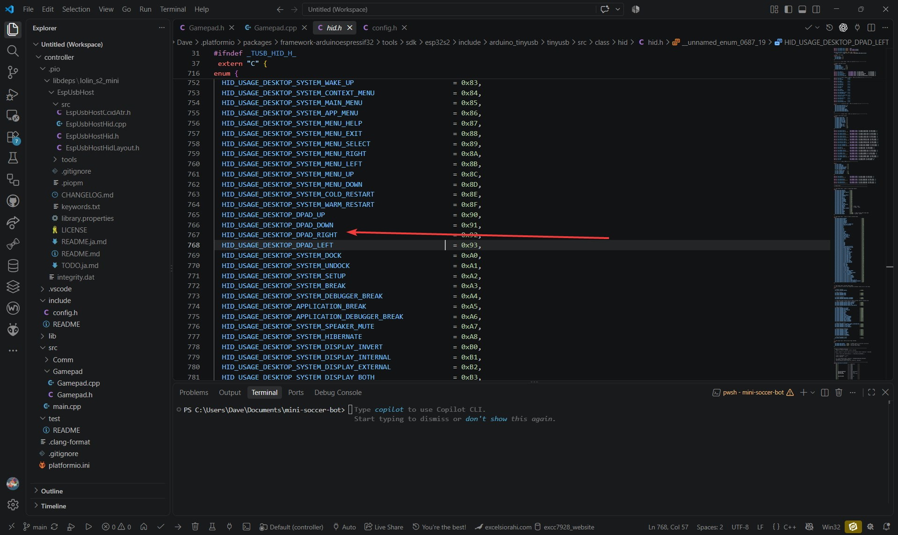 |  |
| ------------------------------- | ---------------------------------- |
Turns out the motor controller has a 5V power supply, so I wouldn't need a buck converter then and shorting EN to 5V it is
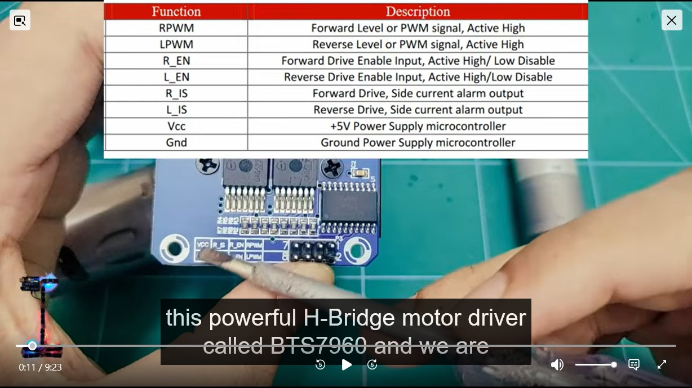

or so I thought, turns out it's required for the ICs to work
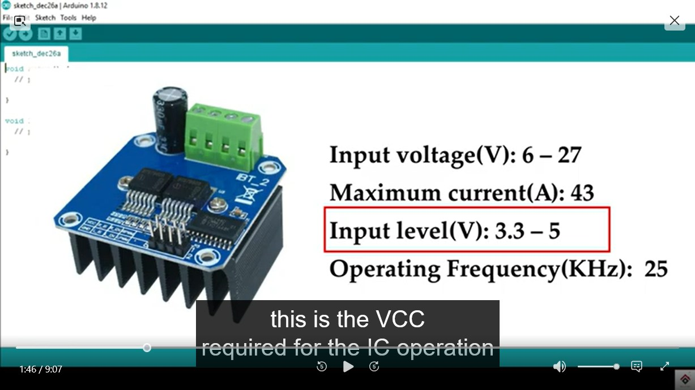
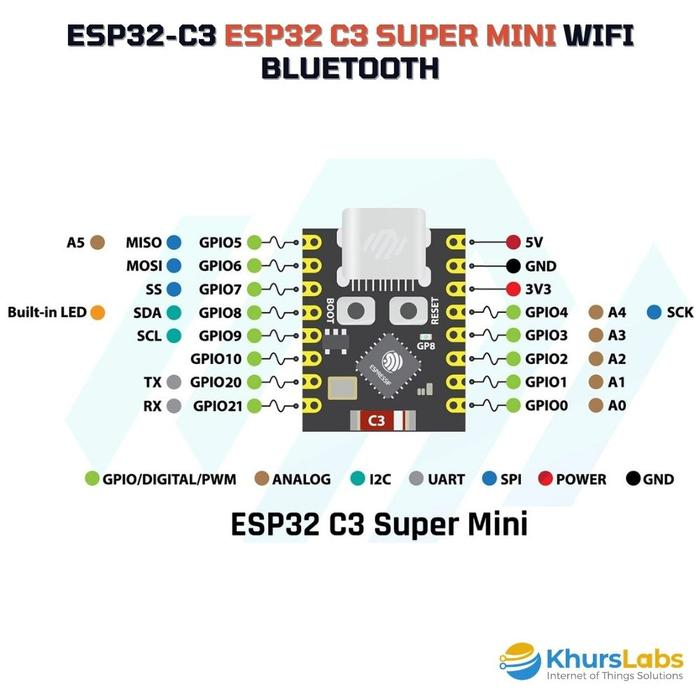

Strapping pins:
- GPIO2 - RTC
- GPIO8 UART flashing (low during reset)
- GPIO9 UART download/SPI boot
> https://pcbartists.com/design/embedded/esp32-c3-gpio-notes-strapping-pins/


Time spent: 2.6 hours
[View lapse](https://lapse.hackclub.com/timelapse/SXwwa24t_wlL)


# August 26: Movement System

## Drive directions

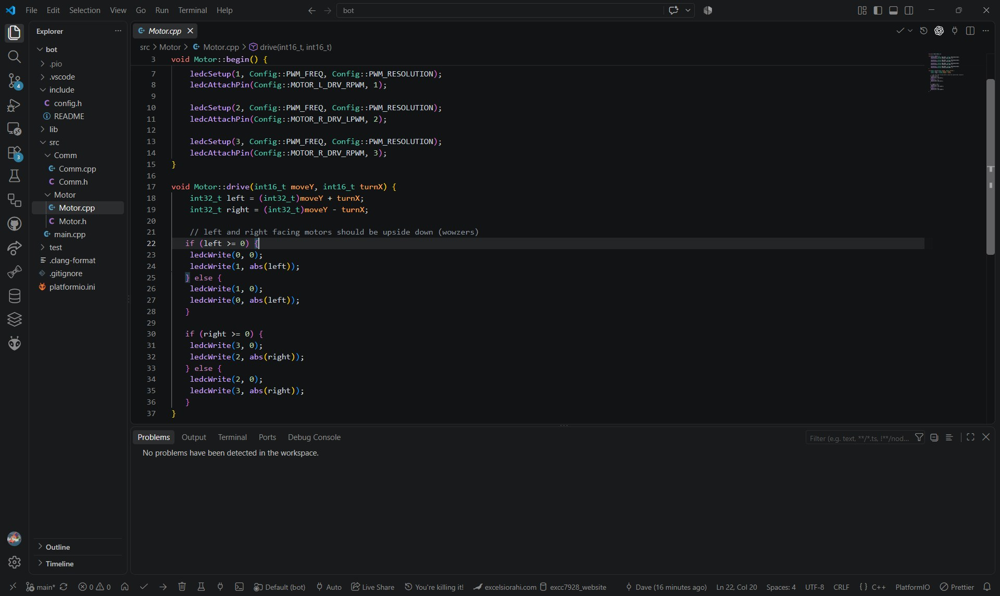

I'm not specifically sure with how would the wiring turn out, but I've named them explicitly along with at config.h so (theoretically) we'd connect them the right way  

## Findings

1.
This seems rather stupid but it turns out that even Serial.println uses RAM by default

> In the AVR processor family, the FLASH is in a different address space from the RAM. Your sketch has easy access to RAM but very limited access to FLASH. To allow your sketch to treat strings as any other data they are all **copied from FLASH to RAM before your sketch starts**.
> 
> There is a trick you use to prevent this copying for string literals used for .print() or .println(). There is a macro named 'F()' that marks the string literal as data that should stay in FLASH and then casts it to special type `('__FlashStringHelper *')`. The cast causes the compiler to select the .print() and ,print() functions that know how to fetch the characters from FLASH (a.k.a. PROGMEM).
> 
> Just change your prints to:  
> `Serial.println(F("This is just a text"));`  
> to save a bunch of RAM

> https://forum.arduino.cc/t/serial-println-random-text-uses-quite-some-ram/981890/3

So, adding F() to save RAM it is :)

2.
`static_cast<type>(value)`
In C++, you're supposed to "cast" it (ve ry cool name I must say), whereas on Python for ex:
```python
a = float(3.14) # doesnt need to explicitly include float() but for explanation reasons
b = int(a) # turns float(3.14) to int(3)
```

> https://www.geeksforgeeks.org/cpp/static_cast-in-cpp/


## Slightly finished code

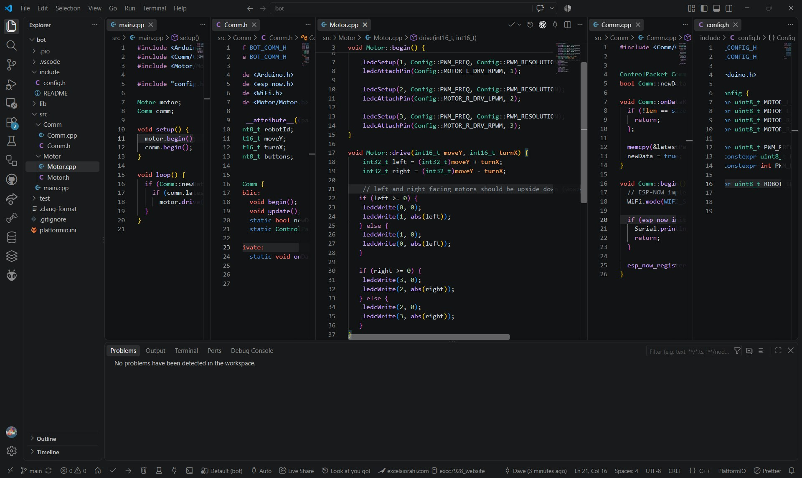
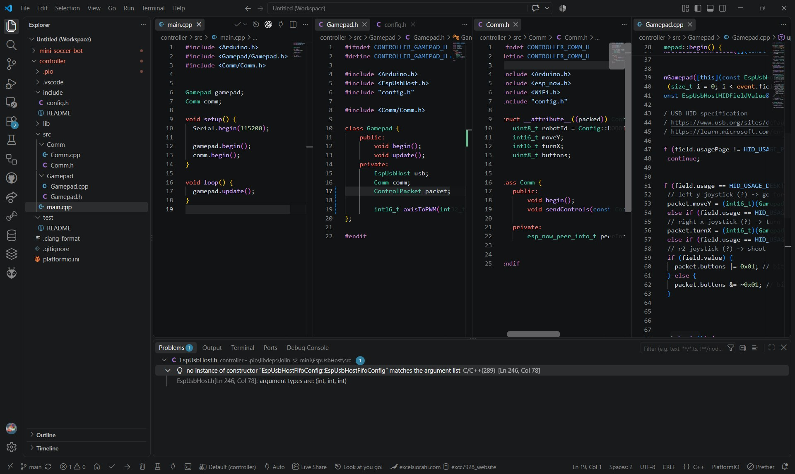


Time spent: 2.3 hours
[View lapse](https://lapse.hackclub.com/timelapse/wXliCoSQogpd)


# August 27: Bot design research

## Winning bots

### 1 - 0 (back) / 7 (front)
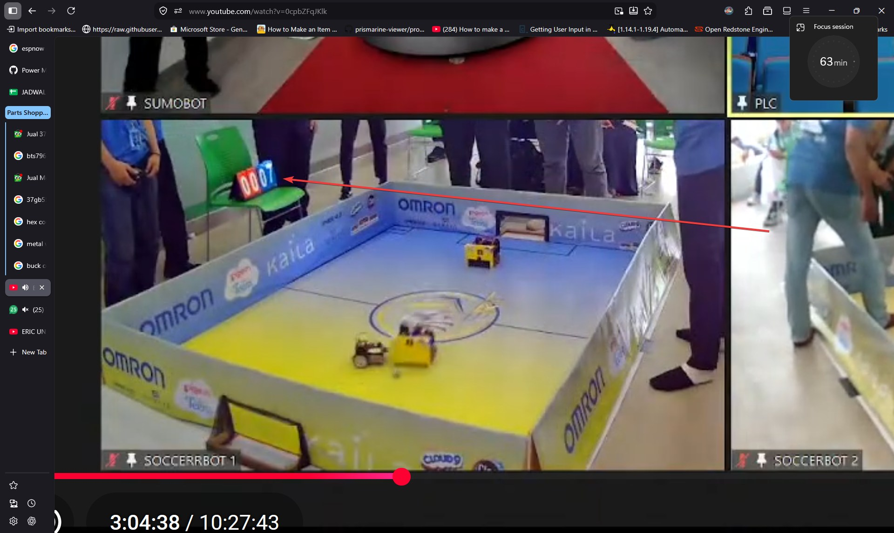

Crashing hard, going insanely fast (more like sumo atp)
> https://www.youtube.com/live/0cpbZFqJKlk?si=qlYBrbrmiiOs4pXE&t=11080

#### Why did opponent lose
1. Lose grip, gets pushed easily
2. Lack of momentum, winning team was colliding at high speeds

### 2 - 7 (back) / 0 (front)

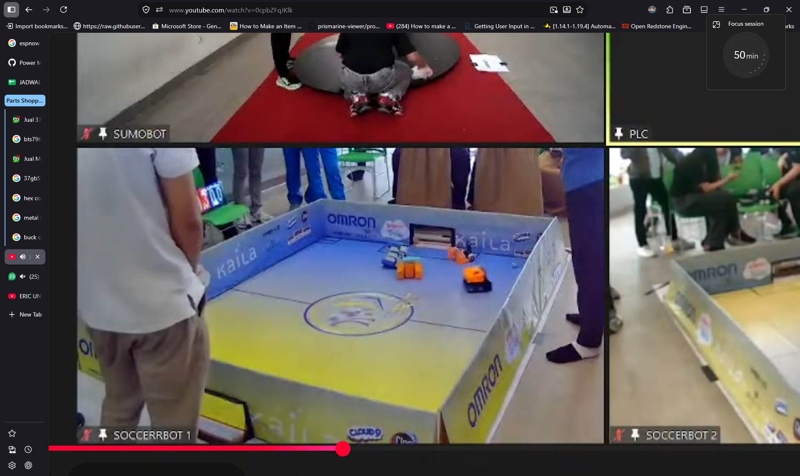
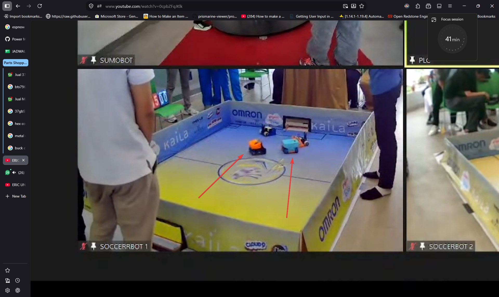

The sides has a rather increase with the middle being a hole (again, makes other bot that crashes to flip while gatekeeping the ball)
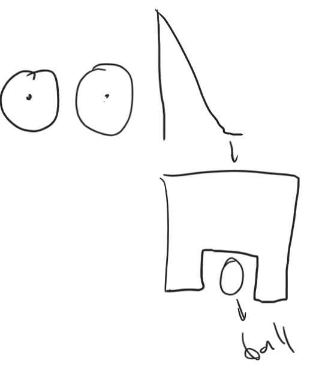

Btw they have 2 bots, one with that and one more with entrance design
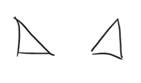

#### Why did opponent lose
1. They kept on flipping backwards
2. It moves so insanely slow

> https://www.youtube.com/live/0cpbZFqJKlk?si=Uul3J3djeLf3dk2C&t=11412


### 3 - 0 (front) / 6 (back)

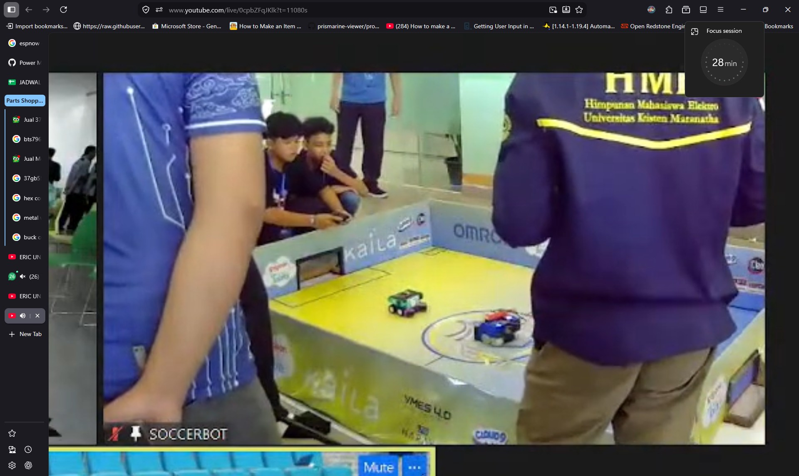

#### Why did opponent lose
1. Able to move fast but has a low torque & grip, therefore got pushed

> https://www.youtube.com/live/0cpbZFqJKlk?si=FYvaNfgzDezZFg4T&t=7043


Time spent: 0.8 hours
View lapse: [1](https://lapse.hackclub.com/timelapse/jDOeW1Oc5YNH)


# August 27: Bot Component and Parts Research

Ive worked on doing research and buying the bot components such as Microcontroller, Battery, etc. Summary of my research on bot components and the links are written down below!

## Parts Purchase Summary

| Item | Qty | Price | Note | Link |
| --- | :-: | --- | --- | --- |
| CNHL Black Series V2 1500mAh | 2 | Rp 233.000 | Battery | https://id.shp.ee/xUu6BF95 |
| B3 Compact Charger 20W | 1 | Rp 119.900 | Charger | https://id.shp.ee/MP6Zjusb |
| BTS7960 43A Motor Driver | 4 | Rp 52.200 | Motor Driver | https://id.shp.ee/tnBzZdRN |
| LM2596 Buck Converter | 3 | Rp 11.000 | Buck Converter | https://id.shp.ee/gZ5Tkxmy |
| Wemos S2 Mini ESP32-S2FN4R2 | 2 | Rp 42.500 | Controller board | https://id.shp.ee/T4hjgRxW |
| ESP32-C3 SuperMini | 2 | Rp 39.900 | Bot MCU | https://id.shp.ee/GHEaAjaf |
| AWG14 Silicone Wire | 2m | Rp 15.000 / m | Power wiring | https://id.shp.ee/Lqaz3kea |
| AWG22 Silicone Wire | 5m | Rp 4.800 / m | Signal wiring | https://id.shp.ee/Re2zaZ1S |
| XT60 Connector | 5 pairs | Rp 11.640 | Battery plug | https://id.shp.ee/uZhk5tnB |
| PS4 Controller | 2 | Rp 210.000 | Remote controller | https://tk.tokopedia.com/ZSVbwTDTH/ |

## 1. Battery (Li-Po)

Why am i choosing lipo was because it has a high discharge rate (C-rating) to supply sudden bursts of power when the motors accelerate or kick the ball. Below are the battery that ive planned to use for the mini soccer-bot and specs are also written down below.

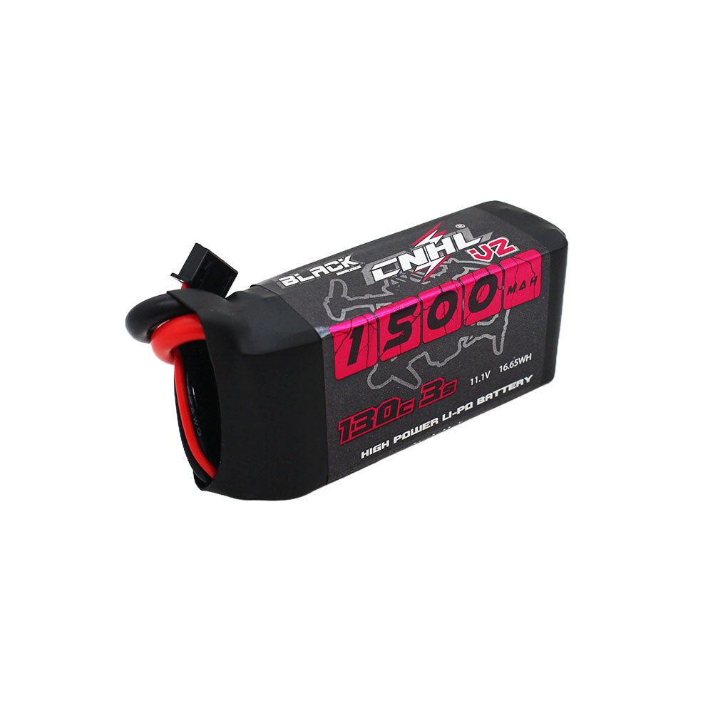

**Name :** CNHL Black Series V2 1500mAh
**Specs :**
  - **Voltage :** 11.1V / 3-Cell / 3S1P
  - **Capacity :** 1500mAh
  - **Discharge Rate (C-rating) :** 130C Continual / 260C Burst
  - **Approx Weight (±5g) :** 125g
  - **Output Connector :** XT60
  - **Balance Connector : ** JST / XH


## 2. Battery Balance Charger

This thing is important because we need to charge our battery :D. Specs and others are written below!

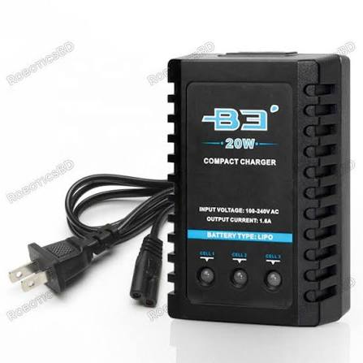
**Name :** B3 Compact Charger 2S 3S Li-Po Balance Battery 20W
**Specs :**
  - **Charging Power :** 20W 
  - **Charge Current :** 1.6A
  - **Balance Charging Current :** 1600mA
  - **Power Input Voltage :** AC 110 to 240V 50/60Hz
  - **Battery Type :** Li-Po 2S /3S
  - **Size :** Approx. 91 x 58 x 35 mm


## 3. Motor Driver

ESP32 are obviously cant handle high current directly. The motor driver takes sighnals from the ESP32 and funnels the high-current power from the battery to the motors. For the motor driver.

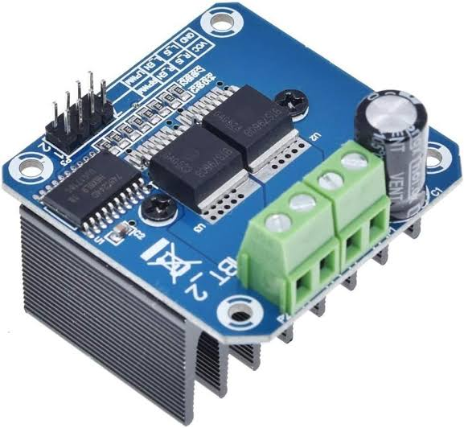
**Name :** BTS7960 43A High Current Motor Driver H-Bridge
**Specs :**
  - **Input / Drive Voltage :** 5.5V to 27V DC
  - **Max Current :** Up to 43A (peak/continuous with proper cooling)
  - **Logic Voltage :** 3.3V - 5V
  - **PWM Frequency :** Up to 25kHz
  - **Dimensions :** 50mm x 50mm z 43mm
  - **Weight : ** ~66g


## 4. Buck Converter

The battery is usually 11.1V+, but the ESP32 needs 3.3V or 5V. A buck converter steps down the voltage efficiently.

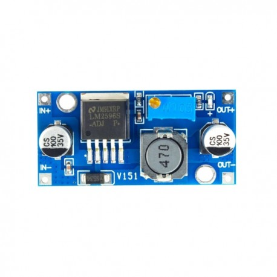

**Name :** DC-DC Step Down Converter LM2596
**Specs :**
  - **Input Voltage Range :** 4.5V to 40V
  - **Output Voltage Options :** 1.23V to 37V
  - **Max Output Current :** 3.0 A
  - **Switching Frequency :** 150 kHz (has a fixed internal oscillator)


## 5. Microcontroller

Microcontroller is the brain of the robot, we use 2 different types of MCU's, the first one is ESP32-C3 Super Mini are for the robot, and the second is Wemos S2 Mini ESP32-S2FN4R2. The second one are used for the stick controller because it needs an USB Host, And thats the cheapest board with USB Host support i could find (i guess). Both specs are listed below. 

**Name :** Wemos S2 Mini ESP32-S2FN4R2

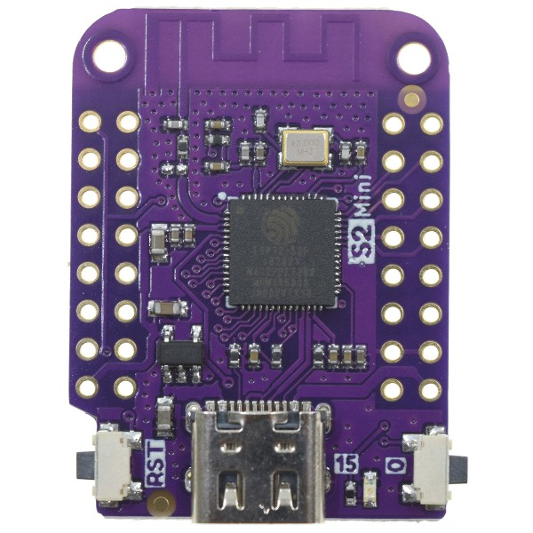

**Specs :**
  - **Chipset :** ESP32-S2FN4R2 (Single Core 32 Bit, 240MHz)
  - **Connectivity :** WiFi 2.4GHz (IEE 802.11 b/g/n)
  - **Interface :** USB Type-C, UART, SPI, I2C, I2S, ADC, DAC, PWM (with 27 pins of GPIO)

**Name :** ESP32-C3 Super Mini Wifi Wireless Bluetooth

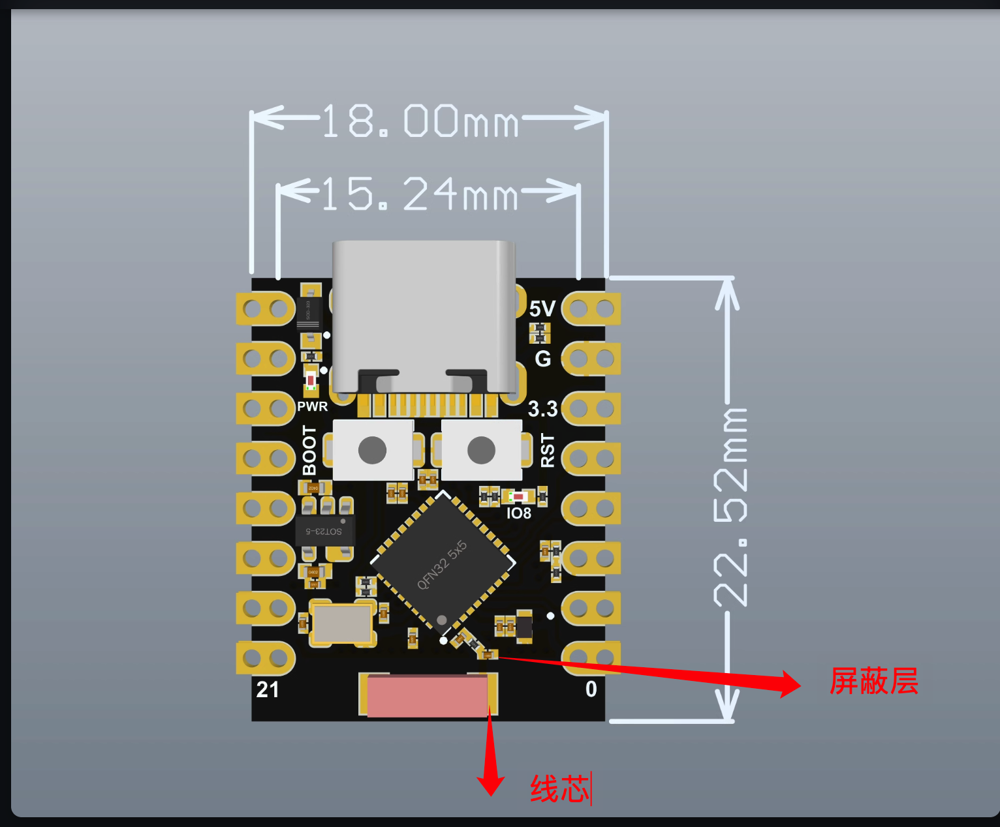

**Specs :**
  - **Chipset :** ESP32-C3 (Single Core 32 Bit RISC-V 160MHz 400KB SRAM)
  - **Connectivity :** WiFi 2.4GHz (IEE 802.11 b/g/n), Bluetooth Low Energy 5.0
  - **Interface :** USB Type-C, UART, SPI, I2C, I2S, ADC, PWM (with 11 pins of GPIO)


## 6. AWG14 Wire

This wire is for connecting the battery to the motor driver or other power stuff because it can handle high current without melting.

**Name :** AWG14 Silicone Wire

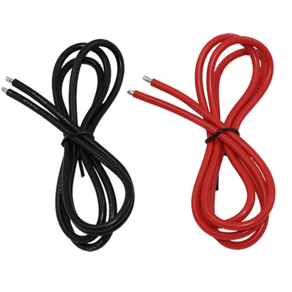

**Specs :**
  - **Material :** Silicone Rubber + Tinned Copper
  - **Temperature Rating :** -60C to 200C
  - **Conductor Gauge :** 14 AWG
  - **Usage :** Battery and power distribution


## 7. AWG22 Wire

This one is thinner, we use it for signal wires like connecting ESP32 to the motor driver and other low power things.

**Name :** AWG22 Silicone Wire

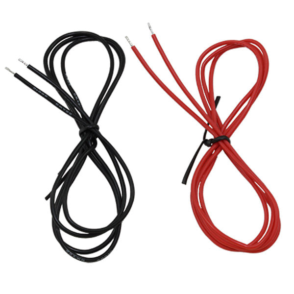

**Specs :**
  - **Material :** Silicone Rubber + Tinned Copper
  - **Temperature Rating :** -60C to 200C
  - **Conductor Gauge :** 22 AWG
  - **Usage :** Logic signals and low power wiring


## 8. XT60 Connector

We need this to connect our battery to the bot's power distribution. It's the standard plug for Li-Po batteries.

**Name :** XT60 Male Female Connector

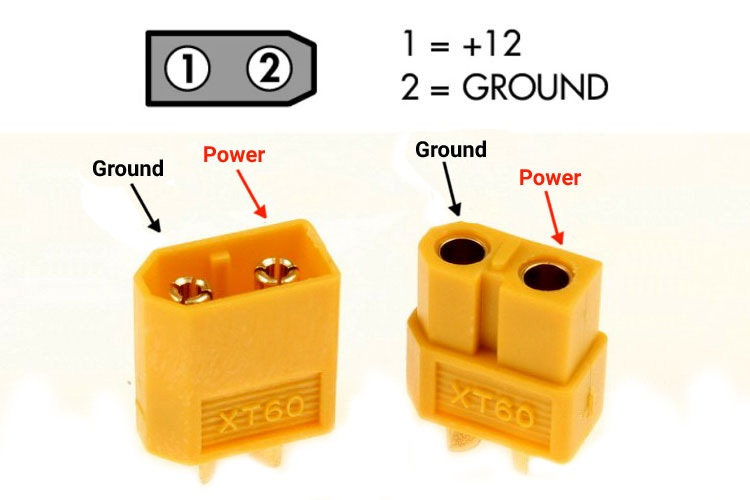

**Specs :**
  - **Material :** Gold plated copper + Nylon
  - **Current Rating :** 60A
  - **Usage :** Battery connection


## 9. PS4 Controller

We will use this controller to remote control our bot.

**Name :** PS4 DualShock 4 Wireless Controller


**Specs :**
  - **Connectivity :** Bluetooth / Micro USB
  - **Power :** Built-in rechargeable battery
  - **Usage :** Stick controller for the robot


## What I learned

For the successes, I managed to find all the key components we need for our bot and kept them under budget. I also found the cheapest ESP32-S2 board with USB Host support so we can use a gamepad.

For the failures, I almost forgot to buy the wires (AWG14 and AWG22) and XT60 battery plugs! I realized this right before ordering everything, otherwise we wouldn't be able to power the bot at all. I also realized we definitely need the buck converter because the 11.1V from the Li-Po is way too high for the ESP32, and using the motor driver's built-in 5V regulator is risky because it might cause the ESP32 to brown out when the motors draw peak current.

Total time spent: 2.0 hours


