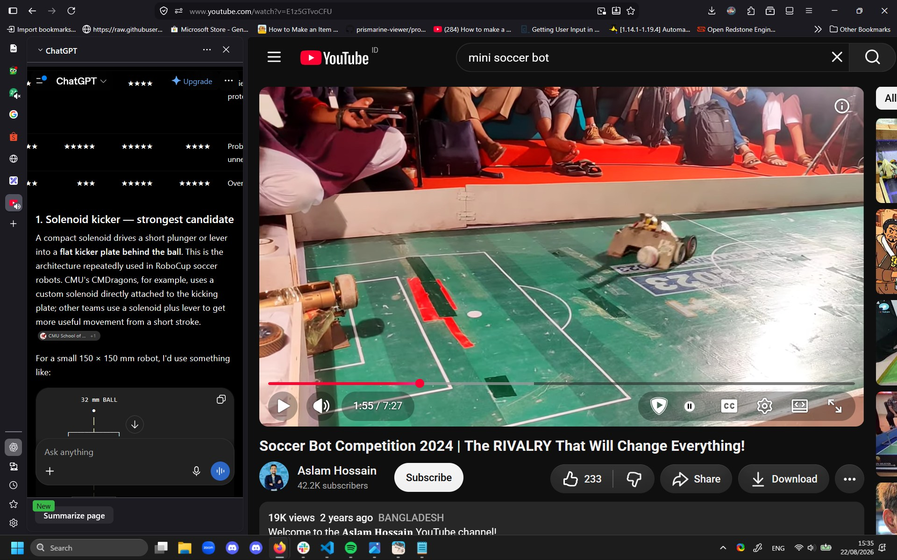
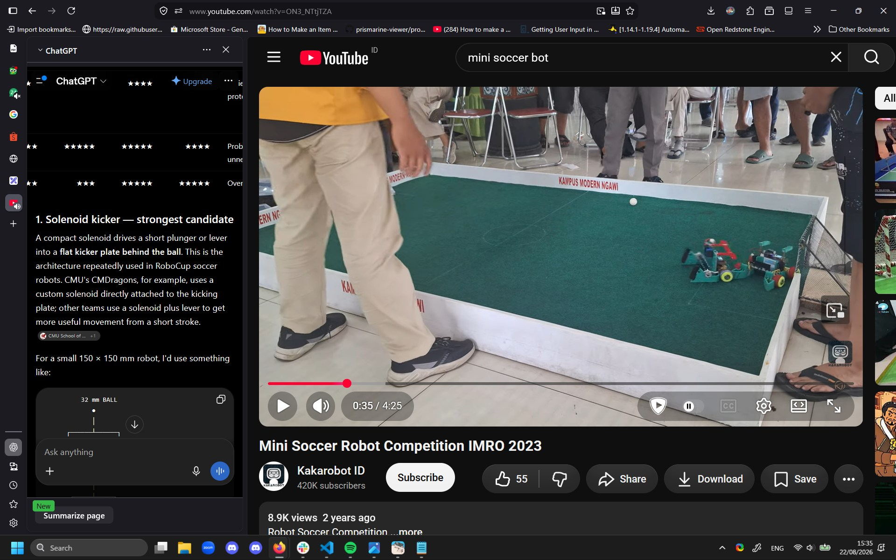
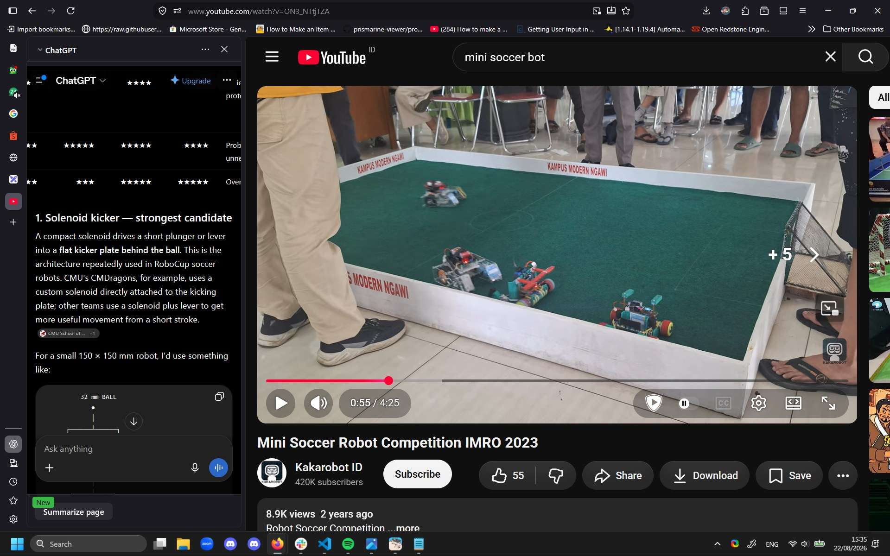
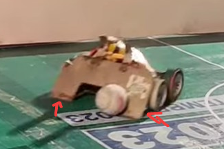
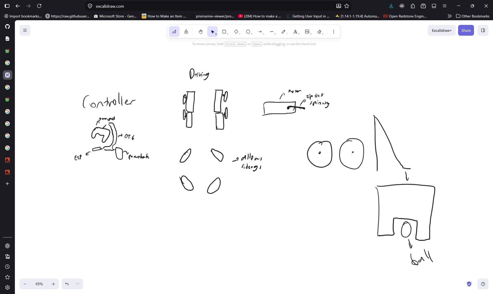
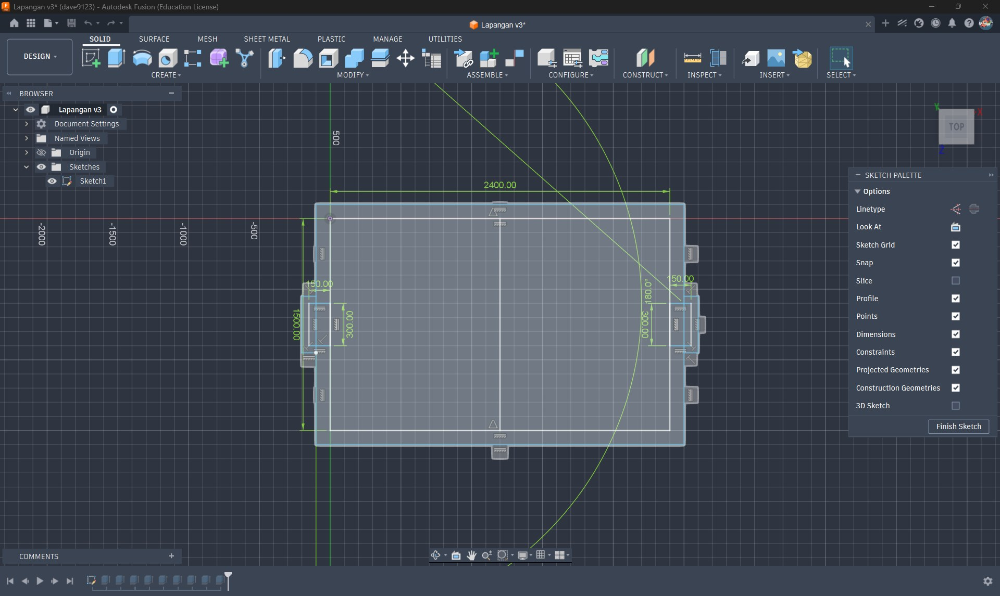
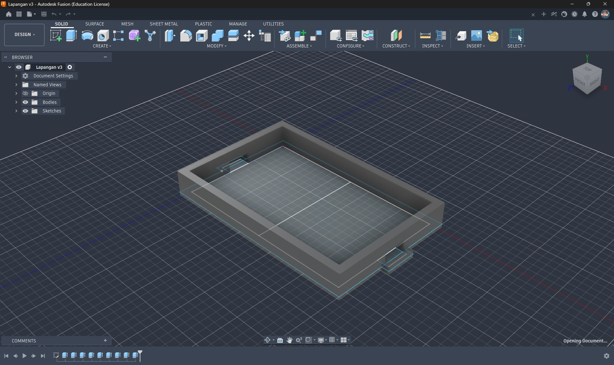

# August 22: Design and Parts Research

## Competition Details

* Max weight 1.5kg
* Robot max dimensions 150x150x200mm
* Ball diameter 32mm
* Front horizontal angle >= 80deg
* RC only, no autonomous
* Ball entering 30mm max (with 50% part of it)
* 2 bots/team

## Controller Parts

| Item          | Qty | Price     | Note                                    | Link                                                                                             |
| ------------- | :-: | --------- | --------------------------------------- | ------------------------------------------------------------------------------------------------ |
| ESP32 S2 Mini |  1  | Rp 55.400 |                                         | https://www.tokopedia.com/solarperfect/wemos-s2-mini-esp32-s2fn4r2-4mb-flash-wifi-board-esp32    |
| USB Gamepad   |  1  | Rp 47.900 |                                         | https://www.tokopedia.com/multikomputer201/gamepad-single-usb-m-techstick-laptopstick-pcjoystick |
| Powerbank     |  1  | -         |                                         | -                                                                                                |
| USB OTG       |  -  | -         | Connecting powerbank to gamepad + ESP32 | -                                                                                                |

## Bot Parts

| Item               | Qty | Price     | Note           | Link                                                                                                |
| ------------------ | :-: | --------- | -------------- | --------------------------------------------------------------------------------------------------- |
| ESP32 C3 SuperMini |  1  | Rp 36.000 |                | https://www.tokopedia.com/khurs-iot/esp32-c3-esp32-c3-super-mini-wifi-bluetooth-1735045712965829864 |
| Buck Converter     |  1  |           | Powering ESP32 |                                                                                                     |
| Motor Controller   |     |           |                |                                                                                                     |
| Li-Po Batteries    |     |           |                |                                                                                                     |
| DC Motors          |     |           |                |                                                                                                     |

|  |  |  |
| ------------------------------------ | ------------------------------------ | ------------------------------------ |

> Researching and finding out the best bot design

## Findings

1.
> LiPo batteries are champs at delivering large amounts of current very quickly. This is often referred to as their "C-rating." A high discharge rate means the battery can dump power rapidly, which is essential for applications needing sudden bursts of energy.
https://chinahobbyline.com/blogs/news/the-advantages-and-disadvantages-of-lipo-batteries

Well, compared to Li-on I suppose? It seems that most drones evne uses Li-Po as their battery instead of Li-on which has a better energy density afaik

2.

A rather curved near to the floor that most sumo robots take advantage of to make other bots slide up (and hopefully fall to their side or even upside down)

## Some sketches

> Bot, kinda still unsure tho

|  |  |
| -------------------------------------- | -------------------------------------- |
> Court

## References

* https://www.youtube.com/watch?v=lchkC-6G3m0 outer design
* https://www.youtube.com/watch?v=stygXlLSs04 electronics
* https://www.youtube.com/watch?v=E1z5GTvoCFU outer design
* https://www.youtube.com/watch?v=YIWJbFjSOe8 https://www.cs.cmu.edu/~robosoccer/small/ wheel + movement design, although it's autonomous

Time spent: 2 hours - [View Lapse](https://lapse.hackclub.com/timelapse/mQ507sRRoyGv)