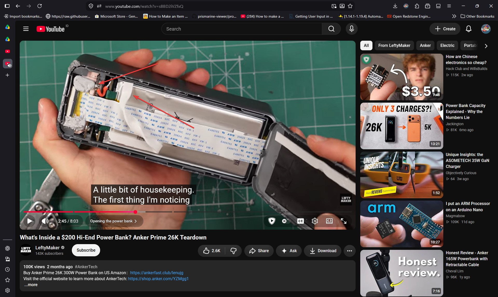
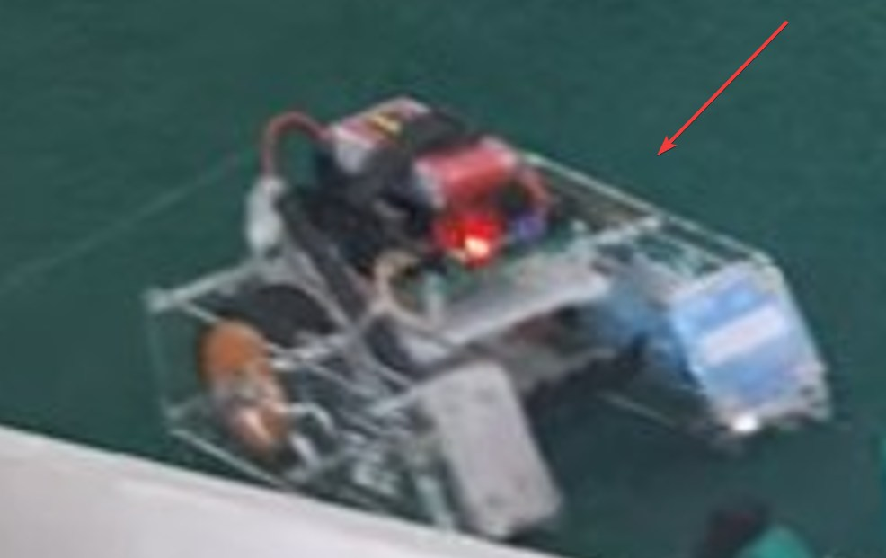
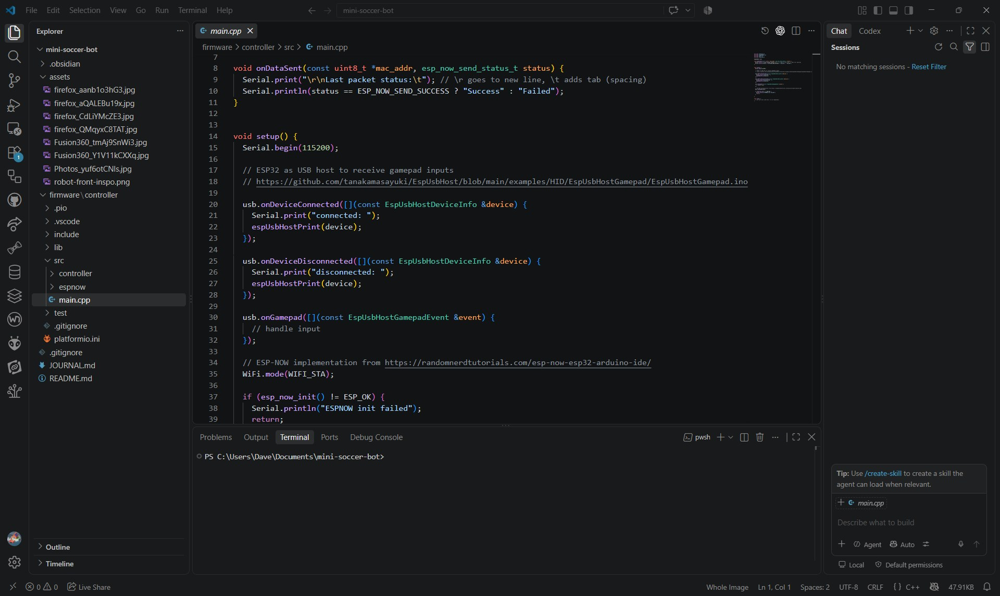
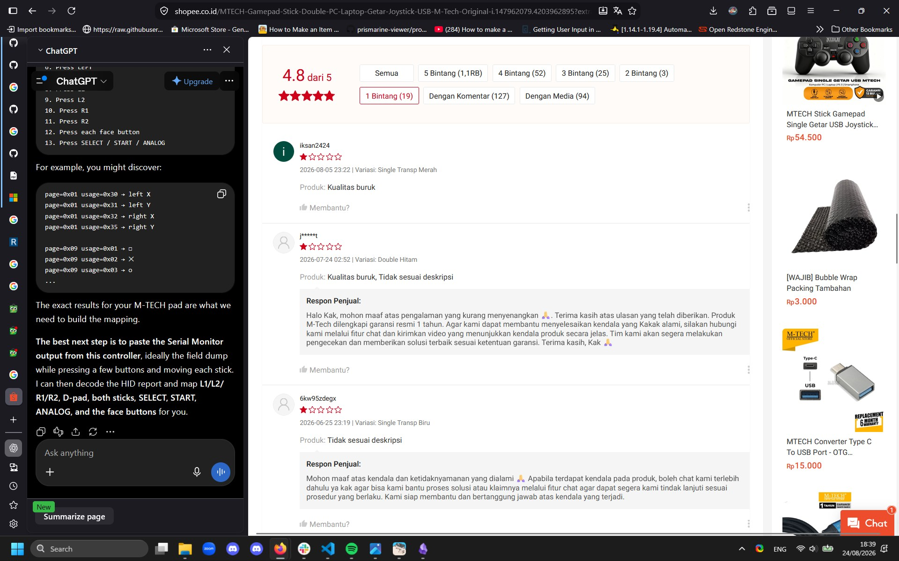
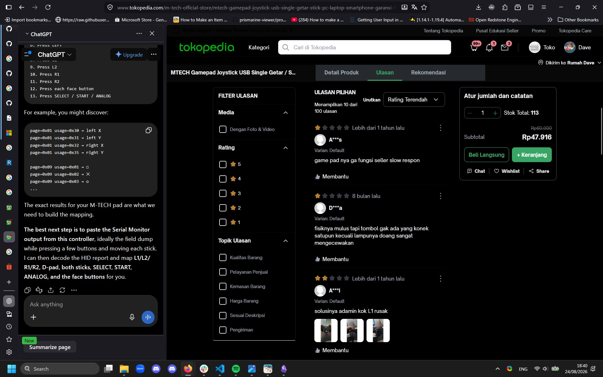
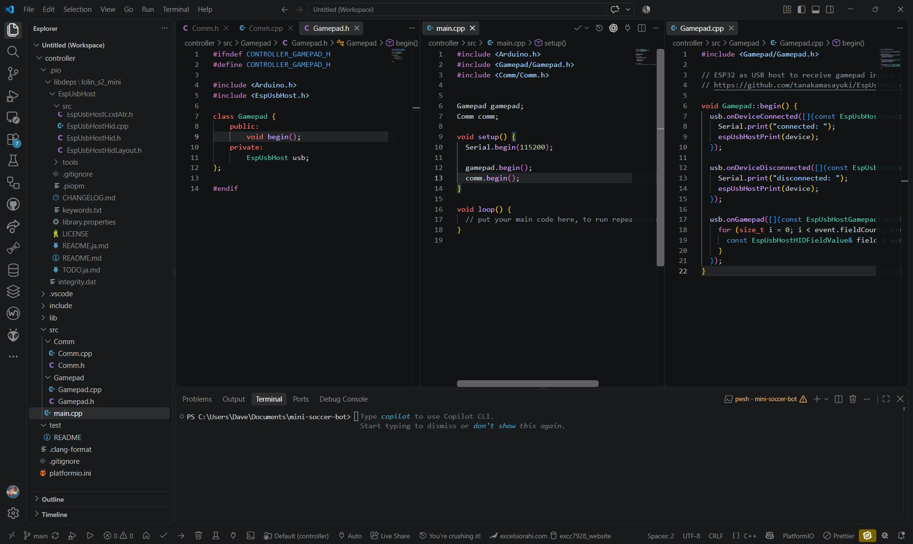
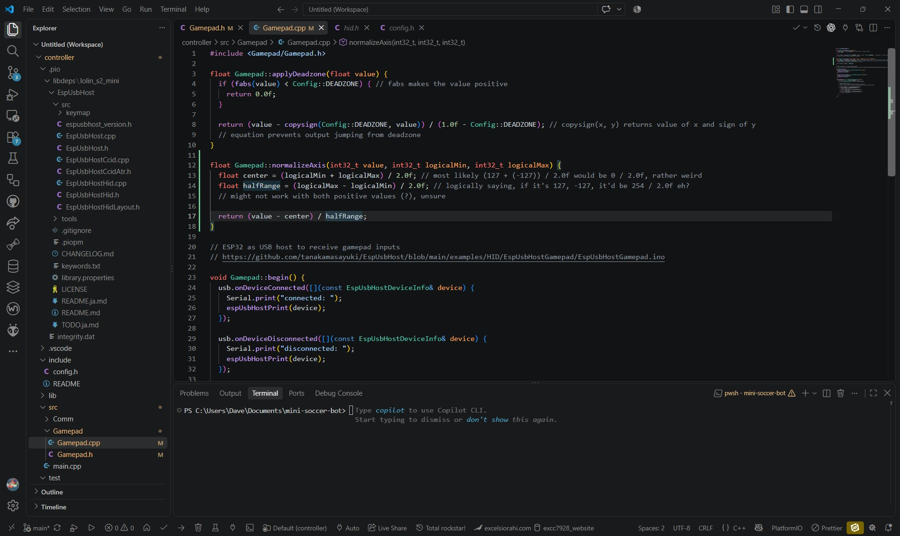

# August 22: Design and Parts Research

## Competition Details

* Max weight 1.5kg
* Robot max dimensions 150x150x200mm
* Ball diameter 32mm
* Front horizontal angle >= 80deg
* RC only, no autonomous
* Ball entering 30mm max (with 50% part of it)
* 2 bots/team

## Controller Parts

| Item          | Qty | Price     | Note                                    | Link                                                                                             |
| ------------- | :-: | --------- | --------------------------------------- | ------------------------------------------------------------------------------------------------ |
| ESP32 S2 Mini |  1  | Rp 55.400 |                                         | https://www.tokopedia.com/solarperfect/wemos-s2-mini-esp32-s2fn4r2-4mb-flash-wifi-board-esp32    |
| USB Gamepad   |  1  | Rp 47.900 |                                         | https://www.tokopedia.com/multikomputer201/gamepad-single-usb-m-techstick-laptopstick-pcjoystick |
| Powerbank     |  1  | -         |                                         | -                                                                                                |
| USB OTG       |  -  | -         | Connecting powerbank to gamepad + ESP32 | -                                                                                                |

## Bot Parts

| Item               | Qty | Price     | Note           | Link                                                                                                |
| ------------------ | :-: | --------- | -------------- | --------------------------------------------------------------------------------------------------- |
| ESP32 C3 SuperMini |  1  | Rp 36.000 |                | https://www.tokopedia.com/khurs-iot/esp32-c3-esp32-c3-super-mini-wifi-bluetooth-1735045712965829864 |
| Buck Converter     |  1  |           | Powering ESP32 |                                                                                                     |
| Motor Controller   |     |           |                |                                                                                                     |
| Li-Po Batteries    |     |           |                |                                                                                                     |
| DC Motors          |     |           |                |                                                                                                     |

|  |  |  |
| ------------------------------------ | ------------------------------------ | ------------------------------------ |

> Researching and finding out the best bot design

## Findings

1.
> LiPo batteries are champs at delivering large amounts of current very quickly. This is often referred to as their "C-rating." A high discharge rate means the battery can dump power rapidly, which is essential for applications needing sudden bursts of energy.
https://chinahobbyline.com/blogs/news/the-advantages-and-disadvantages-of-lipo-batteries

Well, compared to Li-on I suppose? It seems that most drones evne uses Li-Po as their battery instead of Li-on which has a better energy density afaik

2.

A rather curved near to the floor that most sumo robots take advantage of to make other bots slide up (and hopefully fall to their side or even upside down)

## Some sketches

> Bot, kinda still unsure tho

|  |  |
| -------------------------------------- | -------------------------------------- |
> Court

## References

* https://www.youtube.com/watch?v=lchkC-6G3m0 outer design
* https://www.youtube.com/watch?v=stygXlLSs04 electronics
* https://www.youtube.com/watch?v=E1z5GTvoCFU outer design
* https://www.youtube.com/watch?v=YIWJbFjSOe8 https://www.cs.cmu.edu/~robosoccer/small/ wheel + movement design, although it's autonomous

Time spent: 2.1 hours
[View Lapse](https://lapse.hackclub.com/timelapse/mQ507sRRoyGv)

# August 23: Team Sync + Code Research

## Misc Parts

| Item             | Qty | Price | Note         | Link |
| ---------------- | :-: | ----- | ------------ | ---- |
| Battery Charger  |     |       |              |      |
| 14-16 AWG Wire   |     |       |              |      |
| Thermal Adhesion |     |       | Spreads heat |      |

> Added thermal adhesion to the parts list, perhaps to be placed at the motor? Got inspired from the Anker Prime 26K crackdown from https://www.youtube.com/watch?v=sBBD2iVZfxQ

Had a call earlier with my team (isn't included on lapse), we thought of using acrylic as casing, as they're pretty sturdy compared to wood, and they're pretty light too

## Starting to code

Also, made base code for ESP-NOW comms and gamepad parsing inspired from [Random Nerd Tutorials](https://randomnerdtutorials.com/esp-now-esp32-arduino-ide/) and [EspUsbHost](https://github.com/tanakamasayuki/EspUsbHost/blob/main/examples/HID/EspUsbHostGamepad/EspUsbHostGamepad.ino), going need to setup controller for sure 🤣

Time spent: 1.5 hours
[View lapse](https://lapse.hackclub.com/timelapse/SHmiWzEWhFRh)

# August 24: Improving Codebase

My plan:
- left joystick Y -> front/back movement
- right joystick X -> left/right movement
- button (either) -> control flywheel/solenoid to kick

Gotta need to find some drivers or through HID descriptors, but having a physical controller would be 999% better, but I'm rethinking of it now that they break easily (or would even come not working).. 💀

|  |  |  |
| ---------------------------------- | ---------------------------------- | ---------------------------------- |
Also note that these first two are from official stores of M-Tech, which is insanely surprisingly odd, third one being the PS3 controller - might as well use a phone but being able to multitask would be important,,,

And now I have the codebase modulized as it's good practice ;p

## Things learned

1.
`#pragma` is Preprocessing Directive, which can be used when compiling, which in my case is to prevent duplicated imports with `#pragma once`
> https://learncplusplus.org/learn-pragma-pragma-directive-in-c/#What_is_the_pragma_pragma_directive_in_C

Although from what I know, it's more common to use `#ifndef -> #define -> #endif`, but seems way easier than having to name header files for sure
> https://stackoverflow.com/questions/5776910/what-does-pragma-once-mean-in-c

Time spent: 1.5 hours
View lapse: [1](https://lapse.hackclub.com/timelapse/51ZzrH2pc8ha) [2](https://lapse.hackclub.com/timelapse/qRcSrwI6MJxP)

# August 25: 

I'm currently unsure of how should I integrate the kicking controls whereas I'm using both joysticks, left for forward/backward, right for left/right

> Along with my uncertainties on the math, going to need to debug it for sure, as it might not work with both positive values theoretically speaking if the controller's extremely weird

The easiest and most practical button to shoot would be the right side of the pads, as the left thumb is going to be focusing on movement (most likely needs to keep moving)